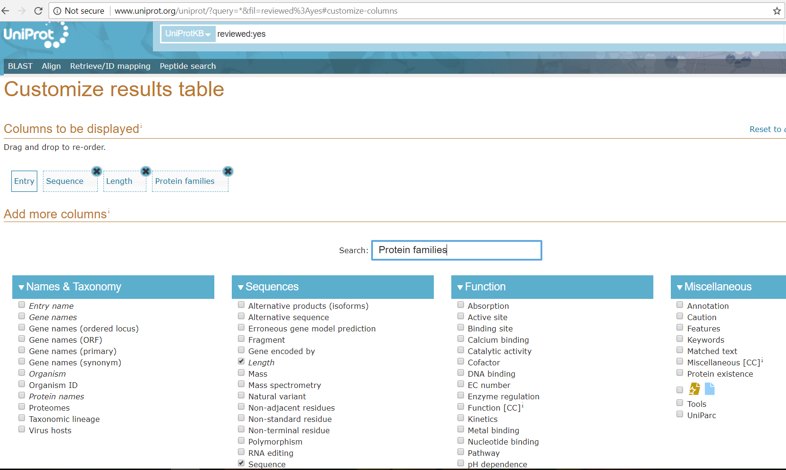
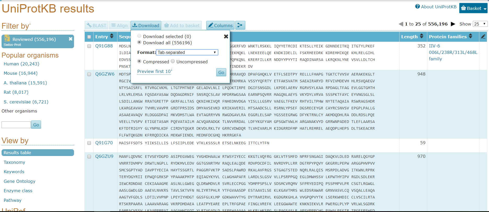

# Protein Family Classification

This repository aims at reproducing results from this [paper](https://cs224d.stanford.edu/reports/LeeNguyen.pdf). 
The project uses tensorflow, scikit, numpy, pandas and nltk,
The model achieved F1 score of 0.83 on cv dataset.
Dataset used is swissprot-kB. Families with < 200 examples and sequences with length > 1000 were removed at the time of preprocessing.
Glove model was used to create embeddings.

## Getting Started
Downloading the dataset - For details checkout the readme file in [data directory](https://github.com/s1998/protein-family-classification/blob/master/data/)
1. Goto this link : <a href="http://www.uniprot.org/uniprot/?query=*&fil=reviewed%3Ayes#customize-columns">http://www.uniprot.org/uniprot/?query=*&fil=reviewed%3Ayes#customize-columns</a>
2. Choose the following columns from the table : Entry, Sequence, Length, Protein families
   
3. Then download the data in tab-separated format.
   
4. Extract and rename the downloaded file as "uniprot-all.tab"

Important : The dataset should be tab separated and should have 4th column as family name.

### Prerequisites

1. Tensorflow
2. Scikit-learn
3. Numpy
4. Pandas
5. NLTK

All the libraries can be installed using pip3. A shell script to install all dependecies would be available in this repository.

### Steps to run the model

Do the following to run the model :

1. chmod +x run.sh
2. ./run.sh

If there is some bug, check the script run.sh.
Steps inside the script are as follows :
1. Download dataset in data folder, rename it to uniprot-all.tab.
2. Go to utils folder, run script1.py.
3. Go to data folder, clone Glove and use "make" command.
4. Run the GloVe model with appropriate parameters 
   (check run.sh line no 17, 19, 21, 23)
5. Go to utils folder, run script2.py
6. Run model.py

This would run the model on the dataset.

## Train time

Each epoch using Tesla-K80 took approx ~ 4 secs for batch size of 128.

## Authors

* [Sudhanshu Ranjan](https://github.com/s1998) and [Udayraj Deshmukh](https://github.com/Udayraj123). 

## Similar repo

* If interested, check out the repo for [Protein Secondary Structure Prediction](https://github.com/Udayraj123/protein-secondary-structure-prediction). 

<!-- ## Acknowledgments

* Hat tip to anyone who's code was used
* Inspiration
* etc
 -->
