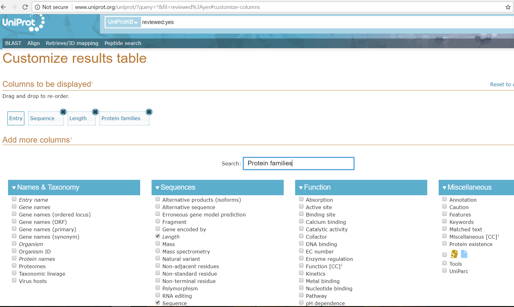

The dataset used in this experiment was the uniprot reviewed protein sequences dataset (swissProt)

# How to Download
As there is no direct download link available on the website. These steps have to be followed to obtain our dataset.

1. Goto this link : <a href="http://www.uniprot.org/uniprot/?query=*&fil=reviewed%3Ayes#customize-columns">http://www.uniprot.org/uniprot/?query=*&fil=reviewed%3Ayes#customize-columns</a>
2. Choose the following columns from the table : Entry, Sequence, Length, Protein families
   
3. Then download the data in tab-separated format.
   

At the time of writing this, the link contained 556,196 reviewed sequences, out of which about 3.7 lakh had non-null family name (filtered out by code).

Important : The dataset should be tab separated and should have 4th column as family name.

